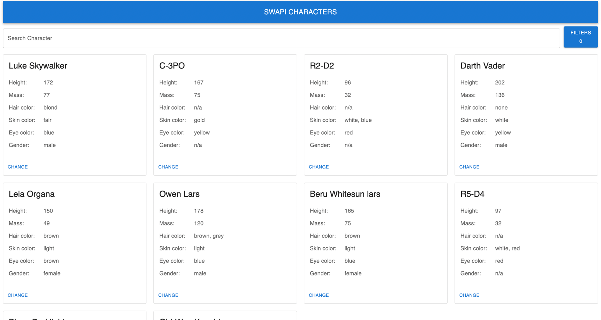

# 🌌 swapiTest

**swapiTest** is a modern web application that interfaces with the [Star Wars API (SWAPI)](https://swapi.dev/), allowing users to explore data from the Star Wars universe. Built with TypeScript and JavaScript, and bundled using Webpack, this project emphasizes performance and scalability.

🔗 **Live Demo**: [swapi-test-pied.vercel.app](https://swapi-test-pied.vercel.app)

---

## ✨ Features


- ⚡ **Fast and Responsive**: Built with performance in mind using Webpack.
- 🛠️ **TypeScript Support**: Strong typing for better development and reliability.
- 📚 **Star Wars API Integration**: Data fetched from [https://swapi.py4e.com/api/](https://swapi.py4e.com/api/)
- 📄 **Pagination Support**: Uses the API's built-in pagination mechanism to load data page by page.
- 🔍 **Client-Side Filtering**: Since the API lacks server-side filtering, filtering is implemented on the frontend per page.
- 🎨 **Customizable UI**: Built with reusable components and a clean design.
- 🚀 **Deployed on Vercel**: Quick and easy access to a live version.

---

## 🛠️ Getting Started

### 📋 Prerequisites

- 🟢 Node.js (v14 or higher)
- 📦 npm or yarn

### 📥 Installation

```bash
git clone https://github.com/DmitryFullStackDev/swapiTest.git
cd swapiTest
npm install
# or
yarn install
```

### ▶️ Running the App
```yaml
npm start
# or
yarn start
```

### 📸 Preview

